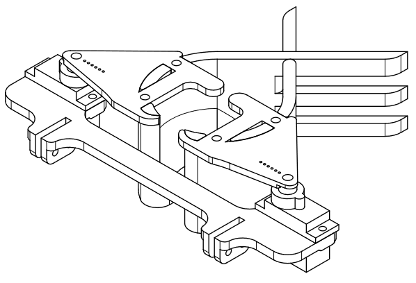

# Hyperion Roboter

 
 
Dieses Repository enthält die Dokumentation des Hyperion Roboters,  
welcher von Simon Schönfeld für den Robocup Rescue Line Wettbewerb 2024 gebaut wurde. 

## Inhaltsübersicht
1. [Über mich](#über-mich)
2. [Regeln des Robocups](#regeln-des-robocups)
3. [Vorheriger Roboter](#vorheriger-roboter)
4. [Planung Hyperion v2](#planung-hyperion-v2)
   - [Platinen](#platinen)
   - [Das Fahrwerk](#das-fahrwerk)
   - [Das Gehäuse](#das-gehäuse)
   - [Die Kamera](#die-kamera)
   - [Schleifkontakte](#schleifkontakte)
   - [Greifarm](#greifarm)
5. [Funktionen](#funktionen)
   - [Linefollowing](#linefollowing)
   - [Kreuzungen](#kreuzungen)
   - [Hindernisse](#hindernisse)
   - [Rescue Area](#rescue-area)
6. [Probleme](#probleme)
7. [Fazit](#fazit)
8. [Zusätzliche Ressourcen](#zusätzliche-ressourcen)

## Über mich
Mein Name ist Simon Schönfeld, ich besuchte seit der 5ten Klasse die Informatik AG meiner Schule. Ziel dieser AG war es, Lego Roboter zu bauen, welche einer Linie folgen, um mit diesen dann einmal im Jahr beim Robocup Wettbewerb teil zu nehmen. 
Obwohl ich es nie geschafft habe, mich mit einem Lego Roboter für die deutschen Meisterschaften des Robocup zu qualifizieren, beschloss ich mich während der Coronapause gemeinsam mit meinem damaligen Teamkameraden, dazu, einen eigenen Roboter zu bauen. 

## Regeln des Robocups
Die Roboter beim Robocup müssen einen Parkour absolvieren, welcher aus einer Schwarzen Linie und einer "Rescue Area" besteht. Der Roboter muss der Schwarzen Linie folgen und dabei verschiedene Hindernisse überwinden. Diese Hindernisse bestehen aus Bumpern, Blockaden und Lücken. An Kreuzungen befinden sich zudem grüne Maskierungen, welche die Roboter erkennen und abhängig von der Position des Punktes drehen müssen. Die Rescue Area wird mit einem Silbernen Streifen eingeleitet. In ihr kann der Roboter Kugeln in verschiedene Ecken befördern, um Zusatzpunkte zu bekommen. Schwarze Kugeln müssen in die rote Ecke, die Silbernen Kugeln müssen in die grüne Ecke.

Die genauen Regeln befinden sich [hier](https://junior.robocup.org/wp-content/uploads/2024/04/RCJRescueLine2024-final-1.pdf).
 
 

## Vorheriger Roboter
Obwohl ich es nie geschafft habe, mich mit einem Lego Roboter für die deutschen Meisterschaften des Robocup zu qualifizieren, beschloss ich mich während der Coronapause gemeinsam mit meinem damaligen Teamkameraden, dazu, einen eigenen Roboter zu bauen. Zu diesem Zeitpunkt war ich zwischen 14 und 15 Jahre alt und wusste so gut wie gar nichts über Elektronik und dem Erstellen von 3D Modellen, lediglich mit dem Programmieren hatte ich mich bereits länger beschäftigt. 
Da sich zu der Zeit auch Niemand in der AG damit auskannte, waren wir mehr oder weniger auf uns alleine gestellt und brauchten bereits mehrere Monate um zum ersten Mal zwei Schrittmotoren zu verwenden. Ich nahm den Roboter mehrfach mit nach Hause und baute und testete ihn dort ausgiebig. 
Als wir schließlich mit dem Roboter angetreten sind, versagte er vollkommen auf Grund von vielen unterschiedlichen Problemen. Dennoch habe ich in diesem Jahr so viel gelernt wie nie zuvor und beherrschte nun Grundkenntnisse in Schaltkreisen, 3D modellieren mit Fusion 360 und der Gesamtmechatronik eines Roboters. Da der Roboter meinem Teammitglied über die Zeit deutlich zu komplex und zeitintensiv wurde baute und programmierte ich ihn fast vollständig alleine und nach dem Wettbewerb verließ er die AG.

>[!NOTE]
> Wenn es darum geht im Robocup zu gewinnen, ist das Bauen eines eigenen Roboters absolut kontraproduktiv. Die Lego Roboter sind inzwischen so ausgereift, dass sie um Welten genauer und simpler sind. Die Gewinner des Robocups sind fast ausschließlich Lego Roboter und auch in den Qualifikationsrunden, an denen ich teilgenommen habe bin ich bis jetzt immer der Einzige Teilnehmer mit einem 100% selbstgebauten Roboter gewesen. Ich baue dennoch einen eigenen Roboter, da es mir nicht um das Gewinnen, sondern um die Herausforderung geht und darum, neue Dinge zu lernen. 

## Probleme des ersten Roboters

- Der Roboter basierte auf einem Fahrwerk eines Schülers, welcher schon vor mehreren Jahren die Schule verlassen hatte. Er hat sich damals mit seinem selbstgebauten Roboter für die deutsche Meisterschaft qualifizieren können. Der Roboter befand sich zu großen Teilen noch im Besitz der AG, weshalb wir das Fahrwerk als Grundbaustein nutzen und über die Zeit immer weiter veränderten. Am Ende war zwar nur noch die verwendete Kette ein Originalteil, dennoch haben wir die Ursprungsmaße nie verändert. Der Roboter war zu klein und Schmal, um noch mehr Bauteile unter zu bringen. Somit bestand der Roboter lediglich aus den Motoren und Treibern, sowie den Farbsensoren, Arduino und Akku. Später fügten wir zudem ein Greifarm hinzu.
 
 

- Aufgrund der Bauweise war es sehr schwierig an das Innere des Roboters zu kommen, weshalb man ihn ständig auseinander bauen musste. Die Kabel waren zudem alle weiß und rot, was schnell zu Verwirrung führte. Der später hinzugefügte Greifarm war sehr schlecht konstruiert und passte nicht wirklich zum Fahrwerk. All dies führte dazu, dass das Finden und Beheben von Fehlern sehr zeitaufwändig gewesen ist. Zudem gab es keine Möglichkeiten die Kugeln überhaubt zu finden oder die Rescue Are überhaubt zu lokalisieren. 
 
 

- Die Kette war nicht rutschfest genug, wodurch der Roboter auf Steigungen wiederholt abrutschte. Die Räder unter den Ketten haben sich zu dem bei zu großer Belastung selber festgezogen und sind regelmäßig blockier, da sie auf Schrauben montiert waren. Die hohe Anzahl an kleinen Bauteilen hat zudem dafür gesorgt, dass an dem kleinen Roboter über 100 Schrauben verbaut waren. Dies machte ihn sehr schwer. Dieses Problem und dadurch, dass die Schrittmotoren sehr ineffizient angesteuert wurden, sorgte dafür, dass der Roboter sich kaum bewegen konnte. 
 
 

- Wenn es darum ging einer einfachen Linie zu Folgen hat der Roboter sehr präzise funktioniert. Dennoch gab es immer wieder Probleme welche schnell dazu führten, dass der Roboter gar nicht mehr funktionierte. Und auch das Erkennen der Kreuzungen funktionierte nur selten, da die Farbsensoren zu ungenau waren und sehr genau kalibriert werden mussten. (Dies liegt auch an dem speziellen Grünton der Punkte)
 
 

 
 
 

# Planung Hyperion v2
 

## Platinen
Statt einem Arduino Mega soll nun ein Raspberry Pi verwendet werden. Dieser ermöglicht es eine Kamera zu verwenden, um die Kugeln zu finden. Zudem ermöglicht er das Nutzen von Multiprozessen. Zudem kann der Roboter nun kabellos programmiert werden und ist insgesamt leistungsfähiger. Damit der Roboter einfach auseinandergebaut werden kann bedarf es mehrer Platinen, welche verschiedene Aufgaben erfüllen. Diese Platinen sind wiederum mit angesteckten Kabeln verbunden. Somit sind keine Bauteile permanent miteinander verbunden und lassen sich leicht zerlegen. 

### Analog-Digital-Wandler
Da die Grünen Punkte an den Kreuzungen durch die Kamera erkannt werden können, benötigt der Roboter lediglich die Grayscalesensoren zum Erkennen der Linie und ein Ultraschallsensor, welcher Hindernisse auf der Fahrbahn erkennen soll. Leider kann der Raspberry Pi die analogen Werte der Farbsensoren nicht selber auslesen, wie es der Arduino getan hat. Aus diesem Grund wird ein Analog zu Digital Wandler benötigt. Genutzt werden zwei MCP3008 Chips mit je 8 Inputs. Diese können über den SPI Bus mit dem Raspberry Pi verbunden werden und befinden sich auf der ersten Platine. Da die Anzahl an Analogen Inputs nicht mehr von den Anschlüssen des Raspberry Pis abhängig ist, sondern rein von der Anzahl an Wandlern, können gleich zwölf Grayscale Sensoren verwendet werden, wobei trotzdem noch vier Anschlüsse offenbleiben. Eine hohe Anzahl an Sensoren ermöglicht es die Linie in einer großen Fläche lokalisieren zu können. Zudem wird der Einfluss eines einzelnen, eventuell fehlerhaften Sensors reduziert. 
 
 

### Stromversorgung
Für die Schaltung werden zwei verschiedene Spannungen benötigt. 12V für die Motoren und 5.1V für den Raspberry Pi. Der Raspberry Pi hat zudem einen 3.3V Pin-Ausgang. Als Stromquelle wird ein 3S 12V LiPo Akku verwendet. Ein Aufwärtswandler bringt diese 12V auf 5.1V, welche über eine Verteilerplatine auf ein USB-Slot geleitet werden. Über ein kurzes USB-Kabel kann so der Raspberry Pi versorgt werden. Wenn man ein externes USB-Kabel verwendet, kann der PI auch angeschaltet und programmiert werden ohne dass die Motoren verbunden sind. An dem Akku befindet sich zudem ein Schalter, um den gesamten Strom abzuschalten und ein Modellflugzeug-Alarm, damit der Akku nicht vollständig entladen wird (und kaputt geht). 
 
 

### Motortreiber
Um die Schrittmotoren ordnungsgemäß bedienen zu können bedarf es an einem Motortreiber für jeden Motor. Um diese Treiber richtig verwenden zu können müssen sie richtig verkabelt werden. Diesen vergleichsweisen komplexen Schaltkreis hatte ich zu Beginn des Projektes noch wie alle anderen Platinen von Hand gelötet. Als ich jedoch schließlich von "a4988" Treibern auf "drv8825" Treiber umgestiegen bin, musste ich eine Änderung an dem Schaltkreis vornehmen. Da die Platine nicht besonders gut verlötet war und die Rückseite der Platine bereits sehr unordentlich geworden ist, entschied ich mich für eine neue Platine. Um es einmal zu testen und mir gleichzeitig das Löten zu sparen, designte ich die Platine digital und ließ sie von einem Online Service herstellen. Das Ergebnis ist deutlich professioneller und weniger anfällig für Schäden als die von Hand gelötete Platine.
 
 

### Knöpfe
Der Roboter muss während des Robocup Wettbewerbes mehrfach von der Fahrbahn genommen werden und an einer anderen Stelle neu gestartet werden. Um den Roboter zu starten und zu stoppen, bedarf es eine Möglichkeit für Manuelle Inputs, da der Roboter während des Wettbewerbes nicht über WLAN verbunden sein darf. Aus diesem Grund befinden sich an der Rückseite des Roboters zwei Knöpfe für mögliche Eingaben und zwei LEDs zur Statusanzeige. 
 
 

### Verteiler
Damit die einzelnen Teile des Roboters einfach und schnell zu verkabeln, empfiehlt es sich breite Stecker zu verwenden, sodass jeweils nur ein Kabelstrang eingesteckt werden muss. Um die Signale auf die richtigen Kabel zu leiten gibt es eine Verteilerplatine, welche sich unter dem Raspberry Pi befindet. Mit ihr ist sowohl die obere Hälfte des Roboters als auch die abnehmbare Heckplatte verbunden. 
 
 

 
 ### Servo Motoren
An der oberen Hälfte des Roboters befinden sich fünf Servo Motoren sowie einen Lüfter. Um diese Bauteile korrekt zu verbinden und dabei nur einen Stecker zu verwenden wird ebenfalls eine Platine verwendet. Zudem befindet sich an dieser Platine ein weiterer Stecker um zwei helle LEDs an der Vorderseite des Roboters mit Strom zu versorgen.
 
 

## Das Fahrwerk
Die meisten Probleme des ersten Roboters entstanden durch das Fahrwerk. Jeder Versuch, eine neue Kette auszudrucken scheiterte, weshalb wir keine Möglichkeit hatten den Roboter zu vergrößern. Die genutzte Kette war sehr glatt und haftete nur schlecht an dem Boden. Um diese Probleme zu vermeiden, nutzt der neue Roboter vier Räder. Die Räder haben einen Durchmesser von 90cm, welches das Überqueren von Bumpern deutlich erleichtert. Um genügend Haftung zu erreichen, werden um die Räder Herum Aktengummibänder geklebt. Diese haben die perfekte Größe und Breite und haften super an glatten Oberflächen.
Damit der Roboter trotz der großen Räder nicht zu schnell fährt und beim Fahren mehr Kraft hat, werden die Räder mit einer Zahnradübersetzung von 15 zu 20 angetrieben. Das kleinere Zahnrad sitzt dabei in der Mitte zwischen den beiden Rädern und ist direkt mit der Motorachse verbunden. Dadurch befinden sich die schweren Motoren genau in der Mitte des Roboters. Die Räder sitzen dabei in Kugellagern, weshalb nur wenig Reibung entsteht. 
 
 

## Das Gehäuse
Eine große Änderung des Roboters ist das Gehäuse. Es bietet den Grundstein für den gesamten Roboter. Ein großer Unterschied zum Vorgänger ist, dass das Gehäuse dieses Mal aus einem großen, einzelnen Stück besteht. In ihm soll die gesamte Elektronik untergebracht werden können und gleichzeitig schnell zu erreichen sein. Damit später alles passt, wurde die Elektronik bereits vorher ausgewählt und getestet, um jedem Bauteil einen festen Platz zu geben. Die Motoren bilden zusammen mit ihren Treibern ein einzelnes Modul, welches sich entfernen lässt, um einfacher an den Motoren arbeiten zu können. Der Mittlere Teil des Roboters besteht also aus den Motoren. Im vorderen Teil befinden sich die Sensoren und im hinteren Teil der Spannungswandler, der Akku und die Platine mit den Analog zu Digital Wandlern. Der Raspberry Pi selber befindet sich auf einer separat abnehmbaren Platte über dem LiPo Akku.
 
 

## Die Kamera 
 Die Kamera soll beim Befahren des Kurses senkrecht nach unten gerichtet sein, um mögliche Kreuzungen zu erkennen. Wenn der Roboter jedoch die entsprechende Maskierung überfährt, muss die Kamera nach vorne gerichtet werden, damit die Kugeln von dem Roboter gefunden und aufgesammelt werden können. Um den Komplikationen eines doppelten Kamerasystems aus dem Weg zu gehen, wird eine einzelne Kamera mit Hilfe eines Servo Motors in die Richtige Position gedreht. Damit die Ausrichtung stimmt werden zudem mehrere Zahnräder genutzt. 
 
 

 

## Schleifkontakte
Damit der Roboter überhaubt Kugeln finden und später einsammeln kann, muss er zuerst die "Rescue Area" finden. Diese beginnt mit einem silbernen Streifen auf der Fahrbahn. Da das Erkennen von Reflektieren von reflektierenden Oberflächen sowohl für die Sensoren als auch für die Kamera zu Komplikationen führen kann, macht der Roboter von einer weiteren (vermutlich unabsichtlichen) Eigenschaft des Streifens gebrauch. Der silberne Streifen leitet Strom und kann daher mit zwei Schleifkontakten erfasst werden. Danach kann sich der Roboter mit Hilfe der Kamera und des Ultraschall-Sensors in der "Rescue Area" zurechtfinden. 
 
 

## Greifarm
Um die Kugeln in der Rescue Area aufsammeln zu können benötigt der Roboter einen Greifarm. Dieser befindet sich während der normalen Fahrt oben auf dem Roboter. Er kann bei Bedarf kann der Greifarm dann heruntergeklappt werden und eine Kugel hochheben. Die Kugel wird dabei in eine Ladefläche gelegt, welche sich ebenfalls auf dem Roboter befindet. In dieser Ladefläche ist Platz bis zu vier Kugeln und sie kann nach hinten weg entleert werden. So kann auch die 6cm hohe Wand der roten und grünen Ecken überwunden werden, zu denen die Kugeln gebracht werden müssen. 
 
 

# Funktionen

## Linefollowing
Der wohl einfachste Teil der Programmierung ist der des Linefollowing. Üblicherweise verläuft das Folgen der Linie bei den Legorobotern nach einem bestimmten Prinzip. Sie besitzen einen Farbsensor links und einen rechts neben der Linie. Steht der Roboter gerade auf der Linie erkennt keiner der beiden Sensoren die schwarze Spur und der Roboter fährt geradeaus. Macht die Linie nun eine Kurve oder kommt der Roboter vom Weg ab, erkennt das der jeweilige Sensor und der Roboter kann seine Position korrigieren. Es kommt jedoch auch häufig vor, dass die Roboter in Endlosschleifen festhängen, wenn sie ungünstig auf der Linie stehen. 

Der Hyperion Roboter hat im Vergleich zu den Lego Robotern den Vorteil, dass er eine deutlich höhere Anzahl von Sensoren nutzen kann. Unter dem Roboter befinden sich also nicht nur zwei sondern gleich zwölf Graustufensensoren, welche die Linie in einem großen Bereich durch die unterschiedlichen Lichtverhältnisse erfassen können. Dies verhindert zum einen, dass der Roboter die Linie verliert und ermöglicht es, dass der Roboter seine Geschwindigkeit gleichmäßig zur Linienposition anpassen kann. Dadurch fährt er gleichmäßig und kommt nur selten ins Stottern. 

## Kreuzungen 
Um an Kreuzungen den richtigen Weg einzuschlagen, muss der Roboter in der Lage sein, grüne Punkte zu erkennen. Dies ist besonders mit den neueren Lego Minestorm Modellen keine Schwierigkeit, da die zugehörigen Sensoren Farben ohne Kalibrierung genau erkennen konnten. Dies ist mit klassischen Arduino-Sensoren deutlich schwieriger, weil sich die Lichtverhältnisse dauerhaft ändern und der Grünton in einem sehr dunkelblauen Spektrum liegt. Aus diesem Grund verwendet der Roboter eine Kamera, um die Kreuzungen zu erkennen. Wenn der Roboter jede Kreuzungsversion abgespeichert hat und erkennen könnte, würde er bei jeder Kreuzung eine vorprogrammierte Aktion abrufen können.

Der erste Ansatz bestand daraus, ein paar Bilder von jeder Kreuzung zu machen und mit dem aktuellen Kamerabild abzugleichen und auszumachen, ob es sich um welche Kreuzung es sich handelte. Diese Methode stellte sich aber als viel zu langsam heraus und spätestens, wenn der Roboter schräg auf der Linie Stand scheiterte das Programm.

Die finale Methode war deutlich komplexer als ein einfacher Vergleich von Bildern. Ich schrieb ein Programm, mit dem ich sehr viele Bilder über die Kamera in kurzer Zeit machen konnte. Damit machte ich von jeder Kreuzung Kategorisiert ca. 1000 Bilder, während ich den Roboter vor und zurück bewegte und drehte. Mit Hilfe dieser Bilder trainierte ich dann eine "KI" also ein simples neuronales Netzwerk, welches die einzelnen Varianten auseinanderhalten konnte. Nach sehr viel Fine Tuning mit Postprocessing und Belichtung konnte der Roboter mit diesem trainierten Modell nun relativ präzise die Kreuzungen erkennen.

## Hindernisse
Um die Wegblockaden zu erkennen, denen der Roboter ausweichen muss, ist in ihm ein Ultraschall-Sensor verbaut, welcher die Entfernung in Fahrtrichtung misst. Dieser Sensor sollte zudem ursprünglich bei der Orientierung in der Rescue Area helfen.

## Rescue Area
Nachdem der Eingang der Rescue Area von den Schleifkontakten erkannt wird, schaltet der Roboter in den Kugel-Sammel-Modus. Die Kamera wird heruntergeklappt, und schaltet auf ein Programm welche Kreise im Bild erkennt. Die erkannten Kugeln können zudem durch die Kamera nach Schwarz und Silber unterteilt werden und werden von dem Greifarm in den Sammelbecher gelegt. Danach sucht der Roboter mit der Kamera und dem Ultraschallsensor die passenden Ecken und liefert die Kugeln dorthin ab. Leider wurde das Programm für die Rescue Area nie zu Ende geschrieben. 

# Probleme

+ Der Roboter war leider ziemlich schwer und hatte somit Probleme die Rampen hinaufzufahren.
+ Die Schrittmotoren waren etwas zu schwach, um immer präzise Bewegungen auszuführen.
+ Die Motoren wurden teilweise so heiß, dass die Achse die PLA-Zahnräder geschmolzen hat und durchgerutscht ist.
+ Teilweise hat sich das Profile von den Rädern gelöst und in den Zahnrädern verfangen.
+ Weil die Kamera so weit vom Drehzentrum entfährt war, war sie nach Kurven nicht über der Linie
+ Die KI konnte zwar präzise Kreuzungen unterscheiden jedoch nie genau ausmachen, ob überhaubt eine Kreuzung vorhanden ist. 
+ Die Schleifkontakte konnten vorwärts zwar über Hindernisse gleiten, blieben aber beim Zurücksetzen hängen.
+ Im Gegensatz zu einem Arduino lässt der Raspberry Pi sich nicht mal eben neu starten. Wenn er abstürzt, ist der Lauf vorbei. 
+ Ich hatte am Ende zu wenig Zeit, um die Programmierung zu vervollständigen und alle Funktionen zu nutzen. 
+ Die einzelnen Funktionen funktionierten zwar, das zusammenhängende Programm hatte jedoch viele Fehler.

# Fazit

Im Robocup Wettbewerb konnte sich der Hyperion Roboter nicht für die deutsche Meisterschaft qualifizieren. Er scheiterte in jedem Lauf an unterschiedlichen Problemen und erreichte in keinem einzigem das Ziel. Dieses Ergebnis ist enttäuschend, war jedoch schon Wochen und Monate vorher vorherzusehen. Der Roboter war extrem overengineered und war in einem einzigen Jahr zu viel Arbeit für eine einzelne Person. Um bei dem Wettbewerb eine Chance zu haben, sollte man Lego Bauteile Nutzen und möglichst gemeinsam an Problemen arbeiten. Dass meine Herangehensweisen und Methoden eher unpraktisch waren war mir von Anfang an Bewusst. Es ging mir allerdings auch weniger um das Gewinnen als darum neue Lösungsansätze für Probleme auszuprobieren, mit denen ich mich schon seit der 5ten Klasse beschäftige. In einzelnen Bereichen war der Roboter extrem präzise und hat super funktioniert und auch ohne den Wettbewerb hätte ich mich warscheinlich mit einem ähnlichen Projekt befasst. 

Durch das Hyperion Projekt habe ich extrem viel neues gelernt in Bereichen wie: 

+ Programmieren in Java und Python 
+ Die Bedienung vom Raspberry Pi inklusive Linux und SSH
+ Auswertung von Kamerabildern mit OpenCV 
+ Das Trainieren von KIs und deren Funktion
+ Die Funktion von unzähligen elektronischen Bauteilen
+ Das professionelle Design von Platinen
+ Elektronische Schaltungen 
+ Löten und Verkabeln
+ 3D Modellierung und Verwendung eines 3D Druckers
+ etc...

Auch wenn der Roboter unter den Letzen Plätzen des Wettbewerbes abgeschnitten hat, würde ich das Projekt allein schon aus diesem Grund jederzeit wiederholen.

>[!NOTE] Sollte jemand Interesse an Weiteren Dateien, Teilelisten oder Infos haben, stelle ich das Gerne zur Verfügung. 

## Zusätzliche Ressourcen

- [vollständige Konstruktionszeichnung](assets/Zeichnung.pdf)
- [ansehbares 3D Modell](https://a360.co/3U4IwDF)
- [STL Dateien](assets/3D_model)
